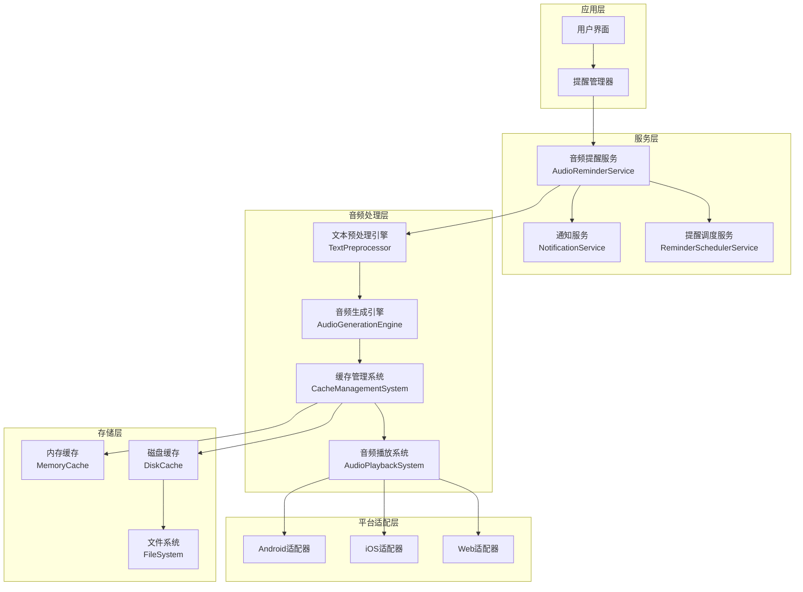
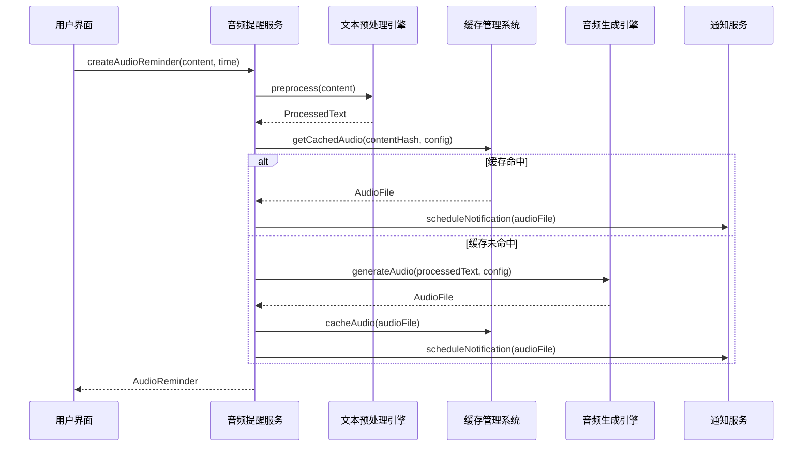
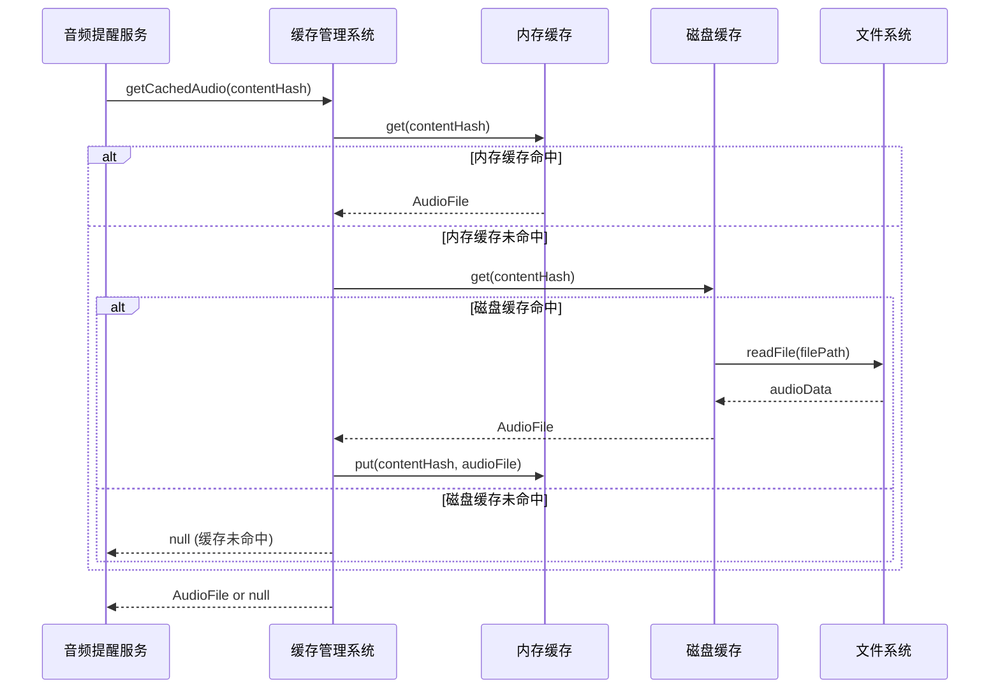

# 动态音频文件生成语音提醒系统 - 设计文档

## 1. 概述

### 1.1 设计目标
基于现有需求分析，本设计文档提出了一套完整的动态音频文件生成语音提醒系统。该系统通过预生成音频文件的方式，彻底解决现有实时TTS在后台和锁屏状态下的播放限制问题。

### 1.2 核心设计理念
- **预生成优先**：将实时TTS转换为预生成音频文件，避免后台播放限制
- **智能缓存**：基于内容哈希的多级缓存机制，提升播放响应速度
- **降级策略**：多重播放策略确保在各种环境下都能正常工作
- **平台兼容**：统一接口适配Android、iOS和Web平台差异

### 1.3 技术优势
- 解决iOS锁屏状态下TTS播放限制
- 提供更稳定的音频播放体验
- 支持高质量语音合成
- 减少实时计算资源消耗

## 2. 系统架构

### 2.1 整体架构图



### 2.2 核心组件说明

#### 2.2.1 音频提醒服务 (AudioReminderService)
- **职责**：统一的音频提醒接口，协调各个子系统
- **功能**：提醒创建、音频生成、播放调度
- **接口**：与现有通知服务和提醒调度服务集成

#### 2.2.2 文本预处理引擎 (TextPreprocessor)
- **职责**：将原始文本转换为适合语音合成的标准格式
- **功能**：数字转换、时间格式化、特殊符号处理
- **输出**：标准化的语音合成文本

#### 2.2.3 音频生成引擎 (AudioGenerationEngine)
- **职责**：将预处理后的文本转换为高质量音频文件
- **功能**：多TTS引擎集成、音频编码、质量优化
- **输出**：压缩优化的音频文件

#### 2.2.4 缓存管理系统 (CacheManagementSystem)
- **职责**：智能管理音频文件的存储和检索
- **功能**：多级缓存、LRU淘汰、预加载
- **优化**：基于使用频率的智能缓存策略

#### 2.2.5 音频播放系统 (AudioPlaybackSystem)
- **职责**：跨平台的音频播放实现
- **功能**：通知铃声集成、降级播放、状态监控
- **适配**：Android/iOS/Web平台差异处理

## 3. 组件设计与接口

### 3.1 音频提醒服务接口

```dart
abstract class AudioReminderService {
  /// 初始化服务
  Future<void> initialize();
  
  /// 创建音频提醒
  Future<AudioReminder> createAudioReminder({
    required String content,
    required DateTime scheduledTime,
    AudioConfig? config,
  });
  
  /// 播放音频提醒
  Future<void> playAudioReminder(AudioReminder reminder);
  
  /// 调度音频提醒
  Future<void> scheduleAudioReminder(AudioReminder reminder);
  
  /// 取消音频提醒
  Future<void> cancelAudioReminder(int reminderId);
  
  /// 获取缓存统计
  Future<CacheStatistics> getCacheStatistics();
  
  /// 清理缓存
  Future<void> cleanupCache({Duration? olderThan});
}
```

### 3.2 文本预处理引擎

```dart
class TextPreprocessor {
  /// 预处理文本
  Future<ProcessedText> preprocess(String rawText, {
    String language = 'zh-CN',
    Map<String, String>? customDictionary,
  });
  
  /// 数字转换
  String convertNumbers(String text, String language);
  
  /// 时间格式化
  String formatTime(String text, String language);
  
  /// 特殊符号处理
  String processSpecialCharacters(String text, String language);
  
  /// 多语言混合处理
  String processMixedLanguage(String text);
}

class ProcessedText {
  final String originalText;
  final String processedText;
  final String language;
  final Map<String, dynamic> metadata;
  final String contentHash;
}
```

### 3.3 音频生成引擎

```dart
class AudioGenerationEngine {
  /// 生成音频文件
  Future<AudioFile> generateAudio(
    ProcessedText text,
    AudioConfig config,
  );
  
  /// 批量生成音频
  Future<List<AudioFile>> batchGenerateAudio(
    List<ProcessedText> texts,
    AudioConfig config,
  );
  
  /// 获取可用TTS引擎
  List<TTSEngine> getAvailableEngines();
  
  /// 设置默认TTS引擎
  void setDefaultEngine(TTSEngine engine);
}

class AudioConfig {
  final String voice;           // 音色
  final double rate;           // 语速 (0.5 - 2.0)
  final double pitch;          // 音调 (0.5 - 2.0)
  final double volume;         // 音量 (0.0 - 1.0)
  final String language;       // 语言
  final AudioFormat format;    // 音频格式
  final int quality;          // 音质等级 (1-5)
}

class AudioFile {
  final String filePath;
  final String contentHash;
  final AudioConfig config;
  final int fileSize;
  final Duration duration;
  final DateTime createdAt;
  final Map<String, dynamic> metadata;
}
```

### 3.4 缓存管理系统

```dart
class CacheManagementSystem {
  /// 获取缓存的音频文件
  Future<AudioFile?> getCachedAudio(String contentHash, AudioConfig config);
  
  /// 缓存音频文件
  Future<void> cacheAudio(AudioFile audioFile);
  
  /// 预加载常用音频
  Future<void> preloadCommonAudio(List<String> commonTexts);
  
  /// 清理过期缓存
  Future<void> cleanupExpiredCache();
  
  /// 获取缓存统计
  CacheStatistics getStatistics();
  
  /// 设置缓存配置
  void setCacheConfig(CacheConfig config);
}

class CacheConfig {
  final int maxMemoryCacheSize;    // 内存缓存大小限制 (MB)
  final int maxDiskCacheSize;      // 磁盘缓存大小限制 (MB)
  final Duration cacheExpiration;  // 缓存过期时间
  final int maxCacheEntries;       // 最大缓存条目数
  final bool enablePreloading;     // 是否启用预加载
}

class CacheStatistics {
  final int totalEntries;
  final int memoryEntries;
  final int diskEntries;
  final double hitRate;
  final int totalSize;
  final DateTime lastCleanup;
}
```

### 3.5 音频播放系统

```dart
class AudioPlaybackSystem {
  /// 播放音频文件
  Future<PlaybackResult> playAudio(
    AudioFile audioFile, {
    PlaybackMode mode = PlaybackMode.notification,
  });
  
  /// 停止播放
  Future<void> stopPlayback();
  
  /// 设置播放配置
  void setPlaybackConfig(PlaybackConfig config);
  
  /// 获取播放状态
  PlaybackStatus getPlaybackStatus();
  
  /// 注册播放事件监听器
  void addPlaybackListener(PlaybackListener listener);
}

enum PlaybackMode {
  notification,    // 作为通知铃声播放
  media,          // 作为媒体文件播放
  alarm,          // 作为闹钟播放
}

class PlaybackConfig {
  final List<PlaybackStrategy> strategies;  // 播放策略优先级
  final int maxRetryAttempts;              // 最大重试次数
  final Duration retryDelay;               // 重试延迟
  final bool enableFallback;               // 是否启用降级播放
}

enum PlaybackStrategy {
  customNotificationSound,  // 自定义通知铃声
  mediaSessionAudio,       // Media Session API
  backgroundAudio,         // 后台音频播放
  webAudioAPI,            // Web Audio API
  htmlAudio,              // HTML Audio
  systemTTS,              // 系统TTS (降级)
}
```

## 4. 数据模型

### 4.1 核心数据模型

```dart
class AudioReminder {
  final int id;
  final String content;
  final String processedContent;
  final DateTime scheduledTime;
  final AudioConfig audioConfig;
  final String contentHash;
  final String? audioFilePath;
  final ReminderStatus status;
  final DateTime createdAt;
  final DateTime? lastPlayedAt;
  final Map<String, dynamic> metadata;
}

enum ReminderStatus {
  pending,      // 等待处理
  processing,   // 正在生成音频
  ready,        // 准备就绪
  scheduled,    // 已调度
  playing,      // 正在播放
  completed,    // 已完成
  failed,       // 失败
  cancelled,    // 已取消
}

class AudioCacheEntry {
  final String contentHash;
  final String configHash;
  final String filePath;
  final int fileSize;
  final DateTime createdAt;
  final DateTime lastAccessedAt;
  final int accessCount;
  final AudioConfig config;
  final Map<String, dynamic> metadata;
}
```

### 4.2 配置数据模型

```dart
class SystemConfig {
  final AudioConfig defaultAudioConfig;
  final CacheConfig cacheConfig;
  final PlaybackConfig playbackConfig;
  final Map<String, dynamic> platformSpecificConfig;
}

class UserPreferences {
  final String preferredVoice;
  final double preferredRate;
  final double preferredVolume;
  final String preferredLanguage;
  final bool enablePreloading;
  final PlaybackMode preferredPlaybackMode;
  final List<PlaybackStrategy> playbackStrategies;
}
```

## 5. 时序图

### 5.1 音频提醒创建流程



### 5.2 音频播放流程

```mermaid
sequenceDiagram
    participant NS as 通知服务
    participant APS as 音频播放系统
    participant PA as 平台适配器
    participant OS as 操作系统
    
    NS->>APS: playAudio(audioFile, mode)
    
    loop 播放策略循环
        APS->>PA: tryPlayback(strategy, audioFile)
        alt 播放成功
            PA->>OS: 播放音频
            OS-->>PA: 播放完成
            PA-->>APS: PlaybackResult(success)
            break
        else 播放失败
            PA-->>APS: PlaybackResult(failed)
            Note over APS: 尝试下一个策略
        end
    end
    
    alt 所有策略失败
        APS->>PA: fallbackToSystemTTS(text)
        PA-->>APS: PlaybackResult
    end
    
    APS-->>NS: 播放结果
```

### 5.3 缓存管理流程



## 6. 平台适配策略

### 6.1 Android平台适配

#### 6.1.1 通知铃声集成
```dart
class AndroidAudioAdapter implements PlatformAudioAdapter {
  Future<PlaybackResult> playAsNotificationSound(AudioFile audioFile) async {
    // 将音频文件设置为自定义通知铃声
    final uri = await _copyToNotificationSoundsDirectory(audioFile);
    
    final androidDetails = AndroidNotificationDetails(
      'audio_reminders',
      'Audio Reminders',
      sound: RawResourceAndroidNotificationSound(uri.path),
      importance: Importance.high,
      priority: Priority.high,
    );
    
    return await _showNotificationWithSound(androidDetails);
  }
  
  Future<Uri> _copyToNotificationSoundsDirectory(AudioFile audioFile) async {
    // 复制音频文件到系统通知铃声目录
    final notificationDir = await getExternalStorageDirectory();
    final targetPath = '${notificationDir!.path}/Notifications/${audioFile.contentHash}.mp3';
    
    await File(audioFile.filePath).copy(targetPath);
    return Uri.file(targetPath);
  }
}
```

#### 6.1.2 后台播放优化
```dart
class AndroidBackgroundPlayback {
  Future<void> setupBackgroundPlayback() async {
    // 配置前台服务
    await _startForegroundService();
    
    // 配置音频焦点
    await _requestAudioFocus();
    
    // 配置媒体会话
    await _setupMediaSession();
  }
  
  Future<void> _startForegroundService() async {
    const platform = MethodChannel('audio_reminder/background');
    await platform.invokeMethod('startForegroundService');
  }
}
```

### 6.2 iOS平台适配

#### 6.2.1 音频会话配置
```dart
class IOSAudioAdapter implements PlatformAudioAdapter {
  Future<PlaybackResult> playAsNotificationSound(AudioFile audioFile) async {
    // 配置音频会话
    await _configureAudioSession();
    
    // 使用UNNotificationSound播放
    final soundName = await _registerCustomSound(audioFile);
    
    final iosDetails = DarwinNotificationDetails(
      sound: UNNotificationSound(soundName),
      presentAlert: true,
      presentSound: true,
    );
    
    return await _showNotificationWithSound(iosDetails);
  }
  
  Future<void> _configureAudioSession() async {
    const platform = MethodChannel('audio_reminder/ios');
    await platform.invokeMethod('configureAudioSession', {
      'category': 'playback',
      'mode': 'default',
      'options': ['mixWithOthers', 'allowBluetooth']
    });
  }
  
  Future<String> _registerCustomSound(AudioFile audioFile) async {
    // 将音频文件复制到应用包的Sounds目录
    final soundsDir = await _getSoundsDirectory();
    final fileName = '${audioFile.contentHash}.caf'; // iOS推荐格式
    final targetPath = '${soundsDir.path}/$fileName';
    
    // 转换音频格式为iOS兼容格式
    await _convertToCAF(audioFile.filePath, targetPath);
    
    return fileName;
  }
}
```

#### 6.2.2 锁屏播放支持
```swift
// iOS原生代码 - AudioSessionManager.swift
class AudioSessionManager: NSObject {
    func configureForBackgroundPlayback() {
        do {
            let audioSession = AVAudioSession.sharedInstance()
            try audioSession.setCategory(.playback, 
                                       mode: .default, 
                                       options: [.mixWithOthers, .allowBluetooth])
            try audioSession.setActive(true)
            
            // 配置远程控制事件
            setupRemoteCommandCenter()
        } catch {
            print("Failed to configure audio session: \(error)")
        }
    }
    
    private func setupRemoteCommandCenter() {
        let commandCenter = MPRemoteCommandCenter.shared()
        commandCenter.playCommand.isEnabled = true
        commandCenter.pauseCommand.isEnabled = true
    }
}
```

### 6.3 Web平台适配

#### 6.3.1 Service Worker音频播放
```javascript
class WebAudioAdapter {
  async playAsBackgroundAudio(audioFile) {
    // 使用多种策略确保播放成功
    const strategies = [
      () => this.playWithMediaSession(audioFile),
      () => this.playWithWebAudio(audioFile),
      () => this.playWithHTMLAudio(audioFile),
      () => this.fallbackToTTS(audioFile.text)
    ];
    
    for (const strategy of strategies) {
      try {
        const result = await strategy();
        if (result.success) {
          return result;
        }
      } catch (error) {
        console.warn('Playback strategy failed:', error);
      }
    }
    
    throw new Error('All playback strategies failed');
  }
  
  async playWithMediaSession(audioFile) {
    // 使用Media Session API
    if ('mediaSession' in navigator) {
      navigator.mediaSession.metadata = new MediaMetadata({
        title: '语音提醒',
        artist: 'VoiceFlow',
        artwork: [{ src: '/icons/icon-192.png', sizes: '192x192' }]
      });
      
      const audio = new Audio(audioFile.url);
      await audio.play();
      
      navigator.mediaSession.playbackState = 'playing';
      return { success: true, method: 'mediaSession' };
    }
    
    throw new Error('Media Session API not supported');
  }
}
```

#### 6.3.2 PWA后台播放
```javascript
// Service Worker中的音频播放
self.addEventListener('push', async (event) => {
  const data = event.data.json();
  
  if (data.type === 'audio_reminder') {
    // 在Service Worker中直接播放音频
    event.waitUntil(
      playAudioInServiceWorker(data.audioUrl, data.text)
    );
  }
});

async function playAudioInServiceWorker(audioUrl, fallbackText) {
  try {
    // 尝试播放预生成的音频
    const response = await fetch(audioUrl);
    const audioBlob = await response.blob();
    const audio = new Audio(URL.createObjectURL(audioBlob));
    
    await audio.play();
  } catch (error) {
    // 降级到TTS
    await fallbackToServiceWorkerTTS(fallbackText);
  }
}
```

## 7. 错误处理与降级策略

### 7.1 音频生成失败处理

```dart
class AudioGenerationErrorHandler {
  Future<AudioFile> handleGenerationFailure(
    ProcessedText text,
    AudioConfig config,
    Exception error,
  ) async {
    // 记录错误
    _logError('Audio generation failed', error, {
      'text': text.processedText,
      'config': config.toJson(),
    });
    
    // 尝试降级策略
    final fallbackStrategies = [
      () => _tryAlternativeTTSEngine(text, config),
      () => _trySimplifiedConfig(text, config),
      () => _trySystemTTS(text),
      () => _generateSilentAudio(text.processedText.length),
    ];
    
    for (final strategy in fallbackStrategies) {
      try {
        final result = await strategy();
        if (result != null) {
          return result;
        }
      } catch (e) {
        _logError('Fallback strategy failed', e);
      }
    }
    
    throw AudioGenerationException('All generation strategies failed');
  }
}
```

### 7.2 播放失败处理

```dart
class PlaybackErrorHandler {
  Future<PlaybackResult> handlePlaybackFailure(
    AudioFile audioFile,
    PlaybackMode mode,
    Exception error,
  ) async {
    // 分析错误类型
    final errorType = _analyzeError(error);
    
    switch (errorType) {
      case PlaybackErrorType.fileNotFound:
        return await _regenerateAndPlay(audioFile);
        
      case PlaybackErrorType.permissionDenied:
        return await _requestPermissionsAndRetry(audioFile, mode);
        
      case PlaybackErrorType.platformNotSupported:
        return await _fallbackToAlternativeMethod(audioFile);
        
      case PlaybackErrorType.systemBusy:
        return await _retryWithDelay(audioFile, mode);
        
      default:
        return await _fallbackToSystemTTS(audioFile.metadata['originalText']);
    }
  }
}
```

### 7.3 缓存错误处理

```dart
class CacheErrorHandler {
  Future<void> handleCacheCorruption() async {
    try {
      // 验证缓存完整性
      final corruptedEntries = await _validateCacheIntegrity();
      
      if (corruptedEntries.isNotEmpty) {
        // 清理损坏的缓存条目
        await _cleanupCorruptedEntries(corruptedEntries);
        
        // 重建缓存索引
        await _rebuildCacheIndex();
        
        // 预加载关键音频
        await _preloadCriticalAudio();
      }
    } catch (e) {
      // 如果修复失败，完全重置缓存
      await _resetCache();
    }
  }
}
```

## 8. 性能优化策略

### 8.1 音频生成优化

#### 8.1.1 批量生成
```dart
class BatchAudioGenerator {
  Future<List<AudioFile>> batchGenerate(
    List<ProcessedText> texts,
    AudioConfig config,
  ) async {
    // 按相似度分组
    final groups = _groupBySimilarity(texts);
    
    // 并行生成
    final futures = groups.map((group) => 
      _generateGroup(group, config)
    );
    
    final results = await Future.wait(futures);
    return results.expand((x) => x).toList();
  }
  
  List<List<ProcessedText>> _groupBySimilarity(List<ProcessedText> texts) {
    // 基于文本相似度和长度分组，优化TTS引擎使用
    return texts.fold<List<List<ProcessedText>>>([], (groups, text) {
      final similarGroup = groups.firstWhereOrNull(
        (group) => _calculateSimilarity(group.first, text) > 0.8
      );
      
      if (similarGroup != null) {
        similarGroup.add(text);
      } else {
        groups.add([text]);
      }
      
      return groups;
    });
  }
}
```

#### 8.1.2 智能预加载
```dart
class IntelligentPreloader {
  Future<void> preloadBasedOnUsagePattern() async {
    // 分析使用模式
    final usageStats = await _analyzeUsagePatterns();
    
    // 预测可能需要的音频
    final predictions = _predictFutureNeeds(usageStats);
    
    // 在空闲时间预生成
    await _scheduleBackgroundGeneration(predictions);
  }
  
  UsageStatistics _analyzeUsagePatterns() {
    // 分析用户的提醒创建模式
    // - 常用词汇
    // - 时间模式
    // - 语音配置偏好
    return UsageStatistics();
  }
}
```

### 8.2 缓存优化

#### 8.2.1 智能缓存策略
```dart
class SmartCacheManager {
  Future<void> optimizeCache() async {
    // 基于访问频率和时间的智能淘汰
    final entries = await _getAllCacheEntries();
    final scores = entries.map(_calculateCacheScore).toList();
    
    // 按分数排序，保留高价值缓存
    final sortedEntries = _sortByScore(entries, scores);
    final toKeep = sortedEntries.take(_getOptimalCacheSize()).toList();
    final toRemove = sortedEntries.skip(toKeep.length).toList();
    
    await _removeCacheEntries(toRemove);
  }
  
  double _calculateCacheScore(AudioCacheEntry entry) {
    final accessFrequency = entry.accessCount / _daysSinceCreation(entry);
    final recency = 1.0 / (_daysSinceLastAccess(entry) + 1);
    final size = 1.0 / (entry.fileSize / 1024); // 偏好小文件
    
    return accessFrequency * 0.5 + recency * 0.3 + size * 0.2;
  }
}
```

#### 8.2.2 压缩优化
```dart
class AudioCompressionOptimizer {
  Future<AudioFile> optimizeAudioFile(AudioFile original) async {
    // 动态调整压缩参数
    final targetSize = _calculateTargetSize(original);
    final compressionLevel = _calculateCompressionLevel(original, targetSize);
    
    // 使用最优参数重新编码
    final optimized = await _reencodeWithParameters(
      original,
      compressionLevel: compressionLevel,
      bitrate: _calculateOptimalBitrate(original),
      sampleRate: _calculateOptimalSampleRate(original),
    );
    
    return optimized;
  }
}
```

### 8.3 播放优化

#### 8.3.1 预加载播放
```dart
class PreloadedPlaybackManager {
  final Map<String, AudioPlayer> _preloadedPlayers = {};
  
  Future<void> preloadForImmediatePlayback(AudioFile audioFile) async {
    final player = AudioPlayer();
    await player.setFilePath(audioFile.filePath);
    await player.load();
    
    _preloadedPlayers[audioFile.contentHash] = player;
    
    // 设置超时清理
    Timer(const Duration(minutes: 5), () {
      _preloadedPlayers.remove(audioFile.contentHash)?.dispose();
    });
  }
  
  Future<PlaybackResult> playPreloaded(String contentHash) async {
    final player = _preloadedPlayers[contentHash];
    if (player != null) {
      await player.play();
      return PlaybackResult.success(method: 'preloaded');
    }
    
    return PlaybackResult.failed(reason: 'Not preloaded');
  }
}
```

## 9. 监控与日志

### 9.1 性能监控

```dart
class PerformanceMonitor {
  final Map<String, Stopwatch> _timers = {};
  final List<PerformanceMetric> _metrics = [];
  
  void startTimer(String operation) {
    _timers[operation] = Stopwatch()..start();
  }
  
  void endTimer(String operation, {Map<String, dynamic>? metadata}) {
    final timer = _timers.remove(operation);
    if (timer != null) {
      timer.stop();
      _recordMetric(PerformanceMetric(
        operation: operation,
        duration: timer.elapsed,
        timestamp: DateTime.now(),
        metadata: metadata ?? {},
      ));
    }
  }
  
  void _recordMetric(PerformanceMetric metric) {
    _metrics.add(metric);
    
    // 异步上报关键指标
    if (_isKeyMetric(metric)) {
      _reportKeyMetric(metric);
    }
    
    // 保持最近1000条记录
    if (_metrics.length > 1000) {
      _metrics.removeRange(0, _metrics.length - 1000);
    }
  }
}
```

### 9.2 错误追踪

```dart
class ErrorTracker {
  Future<void> trackError(
    String operation,
    Exception error, {
    Map<String, dynamic>? context,
    StackTrace? stackTrace,
  }) async {
    final errorReport = ErrorReport(
      operation: operation,
      error: error.toString(),
      stackTrace: stackTrace?.toString(),
      context: context ?? {},
      timestamp: DateTime.now(),
      deviceInfo: await _getDeviceInfo(),
      appVersion: await _getAppVersion(),
    );
    
    // 本地存储
    await _storeErrorLocally(errorReport);
    
    // 异步上报（如果用户同意）
    if (await _shouldReportErrors()) {
      _reportErrorAsync(errorReport);
    }
  }
}
```

### 9.3 使用统计

```dart
class UsageAnalytics {
  Future<void> trackAudioGeneration(
    String contentHash,
    AudioConfig config,
    Duration generationTime,
    bool fromCache,
  ) async {
    await _recordEvent('audio_generation', {
      'content_hash': contentHash,
      'config': config.toJson(),
      'generation_time_ms': generationTime.inMilliseconds,
      'from_cache': fromCache,
      'timestamp': DateTime.now().toIso8601String(),
    });
  }
  
  Future<void> trackPlaybackAttempt(
    PlaybackStrategy strategy,
    PlaybackResult result,
  ) async {
    await _recordEvent('playback_attempt', {
      'strategy': strategy.toString(),
      'success': result.success,
      'error': result.error?.toString(),
      'timestamp': DateTime.now().toIso8601String(),
    });
  }
}
```

## 10. 测试策略

### 10.1 单元测试

```dart
// 文本预处理测试
class TextPreprocessorTest {
  @test
  void testNumberConversion() {
    final processor = TextPreprocessor();
    
    expect(
      processor.convertNumbers('2024年1月1日', 'zh-CN'),
      equals('二零二四年一月一日')
    );
    
    expect(
      processor.convertNumbers('14:30', 'zh-CN'),
      equals('十四点三十分')
    );
  }
  
  @test
  void testSpecialCharacters() {
    final processor = TextPreprocessor();
    
    expect(
      processor.processSpecialCharacters('发送@用户', 'zh-CN'),
      equals('发送at用户')
    );
  }
}

// 缓存管理测试
class CacheManagementTest {
  @test
  void testCacheHitRate() async {
    final cache = CacheManagementSystem();
    final config = AudioConfig.defaultConfig();
    
    // 第一次访问 - 缓存未命中
    var result = await cache.getCachedAudio('hash1', config);
    expect(result, isNull);
    
    // 存储到缓存
    final audioFile = AudioFile.test();
    await cache.cacheAudio(audioFile);
    
    // 第二次访问 - 缓存命中
    result = await cache.getCachedAudio('hash1', config);
    expect(result, isNotNull);
    expect(result!.contentHash, equals('hash1'));
  }
}
```

### 10.2 集成测试

```dart
class AudioReminderIntegrationTest {
  @test
  void testEndToEndAudioReminder() async {
    final service = AudioReminderService();
    await service.initialize();
    
    // 创建音频提醒
    final reminder = await service.createAudioReminder(
      content: '测试提醒内容',
      scheduledTime: DateTime.now().add(Duration(seconds: 5)),
    );
    
    expect(reminder.status, equals(ReminderStatus.ready));
    expect(reminder.audioFilePath, isNotNull);
    
    // 验证音频文件存在
    final audioFile = File(reminder.audioFilePath!);
    expect(audioFile.existsSync(), isTrue);
    
    // 测试播放
    final playResult = await service.playAudioReminder(reminder);
    expect(playResult.success, isTrue);
  }
}
```

### 10.3 性能测试

```dart
class PerformanceTest {
  @test
  void testBatchAudioGeneration() async {
    final generator = AudioGenerationEngine();
    final texts = List.generate(100, (i) => 
      ProcessedText.test(content: '测试内容 $i')
    );
    
    final stopwatch = Stopwatch()..start();
    final results = await generator.batchGenerateAudio(
      texts,
      AudioConfig.defaultConfig(),
    );
    stopwatch.stop();
    
    expect(results.length, equals(100));
    expect(stopwatch.elapsedMilliseconds, lessThan(30000)); // 30秒内完成
  }
  
  @test
  void testCachePerformance() async {
    final cache = CacheManagementSystem();
    
    // 测试大量缓存操作的性能
    final stopwatch = Stopwatch()..start();
    
    for (int i = 0; i < 1000; i++) {
      await cache.getCachedAudio('hash$i', AudioConfig.defaultConfig());
    }
    
    stopwatch.stop();
    expect(stopwatch.elapsedMilliseconds, lessThan(1000)); // 1秒内完成
  }
}
```

## 11. 正确性属性

*属性是一个特征或行为，应该在系统的所有有效执行中保持为真——本质上是关于系统应该做什么的正式声明。属性作为人类可读规范和机器可验证正确性保证之间的桥梁。*

### 11.1 属性反思

在分析需求中的验收标准后，我识别出以下可测试的属性。经过反思，我将一些逻辑上冗余的属性进行了合并：

- 属性1和属性3可以合并为一个综合的音频生成属性
- 属性2和属性4关于缓存性能的可以合并
- 属性7和属性8关于配置的可以合并为配置响应性属性
- 属性12和属性13关于文件管理的可以合并

### 11.2 核心正确性属性

**属性 1: 音频生成一致性**
*对于任何*有效的文本内容和音频配置，系统应该能够生成符合格式要求（AAC/MP3）、大小限制（<100KB）和时间限制（<3秒）的音频文件
**验证需求: 6.1, 6.3, 6.4, 5.1**

**属性 2: 缓存一致性和性能**
*对于任何*相同的文本内容和音频配置组合，第二次及后续请求应该使用缓存的音频文件，且播放延迟应小于500ms
**验证需求: 2.1, 2.2**

**属性 3: 缓存管理正确性**
*对于任何*缓存操作序列，系统应该正确实施LRU淘汰策略，自动清理过期缓存，并维持缓存命中率≥80%
**验证需求: 2.3, 2.4, 7.2, 5.2**

**属性 4: 多语言和音色支持**
*对于任何*支持的语言（中文、英文）和音色配置（男声、女声、儿童声），系统应该能够生成相应的音频文件
**验证需求: 1.3, 3.1, 3.3**

**属性 5: 语音参数响应性**
*对于任何*语速调节（0.5x-2.0x范围内）和音量设置，生成的音频文件应该反映这些参数，且配置变更应立即生效
**验证需求: 1.4, 3.2, 3.4**

**属性 6: 文本预处理正确性**
*对于任何*包含数字、时间格式或特殊字符的文本，预处理引擎应该将其转换为适合语音合成的标准格式
**验证需求: 6.1**

**属性 7: 通知集成正确性**
*对于任何*生成的音频文件，系统应该能够将其正确设置为自定义通知铃声并在通知触发时播放
**验证需求: 4.3, 8.1**

**属性 8: 跨平台播放兼容性**
*对于任何*目标平台（Android、iOS、Web），音频播放系统应该能够使用平台原生方法成功播放音频文件
**验证需求: 8.2**

**属性 9: 降级播放策略**
*对于任何*播放失败的情况，系统应该按照预定义的策略顺序尝试替代播放方法，直到成功或所有方法都失败
**验证需求: 8.3**

**属性 10: 批量处理效率**
*对于任何*批量音频生成请求，系统应该能够高效处理并支持预加载常用提醒内容
**验证需求: 5.4, 7.3**

**属性 11: 存储监控准确性**
*对于任何*存储操作，系统应该准确报告存储空间使用情况并正确执行存储空间管理
**验证需求: 5.3**

**属性 12: 缓存持久化一致性**
*对于任何*缓存的音频文件，在应用重启后应该能够正确恢复并继续使用
**验证需求: 7.4**

**属性 13: 播放状态监控**
*对于任何*音频播放操作，系统应该正确跟踪播放状态并适当处理播放错误
**验证需求: 8.4**

### 11.3 边界条件属性

**属性 14: 空文本处理**
*对于*空字符串或仅包含空白字符的文本，系统应该优雅地处理并返回适当的错误或生成静音音频

**属性 15: 极限配置处理**
*对于*边界值配置（语速0.5x和2.0x，最大和最小音量），系统应该正确生成音频而不出现错误

**属性 16: 缓存容量边界**
*对于*缓存达到容量限制的情况，系统应该正确执行淘汰策略而不影响正常操作

## 12. 测试策略

### 12.1 双重测试方法

本系统采用单元测试和基于属性的测试相结合的综合测试策略：

- **单元测试**：验证特定示例、边界条件和错误情况
- **基于属性的测试**：验证所有输入范围内的通用属性
- **集成测试**：验证组件间的交互和端到端流程

### 12.2 基于属性的测试配置

- **测试库选择**：使用 `test` 包结合自定义属性测试框架
- **迭代次数**：每个属性测试最少运行100次迭代
- **测试标记**：每个属性测试必须标记对应的设计文档属性
- **标记格式**：**Feature: dynamic-audio-reminder-system, Property {number}: {property_text}**

### 12.3 测试覆盖策略

**单元测试重点**：
- 文本预处理的具体转换规则
- 音频编码格式验证
- 缓存键生成逻辑
- 错误处理边界情况

**属性测试重点**：
- 音频生成的一致性和性能
- 缓存行为的正确性
- 跨平台播放兼容性
- 配置变更的响应性

**集成测试重点**：
- 端到端音频提醒流程
- 平台特定的播放机制
- 缓存与播放系统的协作
- 错误恢复和降级策略

---

**文档版本**: 1.0  
**创建日期**: 2024年2月3日  
**最后更新**: 2024年2月3日  
**负责人**: 开发团队  
**审核人**: 技术架构师